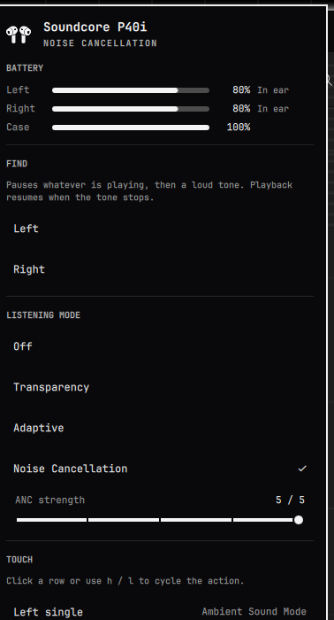

# Better Omapods

Common Bluetooth earbuds and headphones in the Omarchy bar. It picks whichever
supported pair is connected — preferring the one that is currently playing audio.

| Family | Battery | ANC / modes | Find | Touch |
|--------|---------|-------------|------|-------|
| **Soundcore** (OpenSCQ30: P40i, Liberty, Space, Q30, …) | per-bud + case | yes | yes | yes |
| **AirPods / Beats** (librepods, same daemon as omapods) | per-bud + case | yes | yes | — |
| **Other Bluetooth** (Sony, Bose, Galaxy Buds, …) | combined, if BlueZ reports it | — | yes | — |

Full listening-mode control on Linux needs a vendor protocol. Soundcore uses
[OpenSCQ30](https://github.com/Oppzippy/OpenSCQ30); AirPods use
[librepods](https://github.com/kavishdevar/librepods). Everything else gets
battery (when the headset exposes it) and Find.

Sony XM, Bose QC, and Galaxy Buds still have no first-class ANC channel in this
plugin. Find still plays a tone on their Bluetooth sink.

<p align="center">
  
</p>

## What it shows

- **Battery** for left, right, and case when the hardware reports them, or a
  single headphones row for over-ear models. Each bud shows **In ear**,
  **In case**, or **Charging**.
- **Listening modes the device actually has.** Off, Transparency, Adaptive, and
  Noise Cancellation appear for Soundcore (OpenSCQ30) and AirPods (librepods).
  Soundcore Noise Cancellation includes an **ANC strength** slider; AirPods
  Adaptive includes a noise-level slider.
- **Find.** Left, Right, or Headphones pauses whatever is playing, then a
  locating tone on that side. Playback resumes when the tone stops. A warning
  has to be accepted first — the tone is loud on purpose.
- **Touch.** Single, double, triple, and hold for each bud, plus a touch-tone
  toggle and reset to defaults when the device has them.

The bar mark uses the same AirPods-style silhouette omapods paints: Pro buds
for in-ear models, Max cups for over-ear. **Auto** follows the connected
device; the widget setting can lock it to either.

Volume, connect, and forget stay in the stock Audio and Bluetooth panels.

Left click opens the panel. Right click cycles the listening mode.

## Keyboard

| Key | Action |
|-----|--------|
| `j` / `k`, arrows | move between rows |
| `h` / `l` | ANC strength, or cycle the selected touch action |
| `enter` / `space` | select the current row |
| `o` | Off |
| `t` | Transparency |
| `a` | Adaptive |
| `n` | Noise Cancellation |
| `f` | find (warning first) / stop |
| `r` | refresh |
| `tab` | next panel |
| `esc` | close |

A key for a mode the hardware does not have does nothing.

## Install

```bash
omarchy plugin add https://github.com/Dakota-DITS/omarchy-better-omapods.git --enable
~/.config/omarchy/plugins/ddewolfe.better-omapods/setup
```

`setup` starts the status bridge. For Soundcore, install
[OpenSCQ30](https://github.com/Oppzippy/OpenSCQ30). For AirPods/Beats, install
[librepods](https://github.com/kavishdevar/librepods) (omapods already does
this). Pair headphones in Bluetooth as usual.

Plugin id is `ddewolfe.better-omapods`.

## Remove

```bash
systemctl --user disable --now ddewolfe-better-omapods.service
rm -f ~/.config/systemd/user/ddewolfe-better-omapods.service
rm -rf ~/.local/state/better-omapods
omarchy plugin remove ddewolfe.better-omapods
```

## Tests

```bash
deno run --allow-read tests/model.test.js
python3 tests/bridge.test.py
```

## Credits

Device control is [OpenSCQ30](https://github.com/Oppzippy/OpenSCQ30) by
Oppzippy. The AirPods panel that proved this bar idiom is
[omapods](https://github.com/thisisgm/omarchy-pods) by GM; this plugin does not
bundle or fork that work.

## Licence

MIT. See [LICENSE](LICENSE). Soundcore is a trademark of Anker Innovations,
which does not sponsor this plugin. AirPods is a trademark of Apple Inc.
omapods is GM's AirPods plugin and is not affiliated with this listing.
